# Whisper Dictation

**macOS-only** menu bar app for voice-to-text dictation using OpenAI's Whisper model.

## Core Feature: Voice-to-Text Dictation

Press a key, speak, and your words appear as text - anywhere.

```mermaid
flowchart LR
    Record[🎙️ Record Voice] --> Transcribe[🤖 Transcribe]
    Transcribe --> Paste[📝 Paste Text]

    style Record fill:#FFB6C1
    style Transcribe fill:#87CEEB
    style Paste fill:#90EE90
```



**How?** Press **Globe/Fn** to start → speak → press **Globe/Fn** to stop. Done.

Works in any app - email, notes, code editor, chat, anywhere you can type.

## Additional Features

The app also supports advanced AI-powered features:
- **AI Text Enhancement** - Select text + voice command → AI modifies it
- **Text-to-Speech** - Select text → have it read aloud
- **Task Manager** - Voice-controlled tasks with priorities and due dates

<details>
<summary>See how advanced features work (click to expand)</summary>


</details>

## Quick Setup

```bash
# 1. Install dependencies (requires Python 3.12)
python3.12 -m venv venv
source venv/bin/activate
pip install -r requirements.txt
brew install portaudio mpg123

# 2. Configure OpenAI API (optional - for AI features)
cp .env.example .env
# Edit .env with your OpenAI API key from https://platform.openai.com/api-keys

# 3. (Optional) Configure Zscaler certificate if using corporate proxy
# Skip this step if not using Zscaler or your company doesn't use it
# See "Zscaler Setup" section below

# 4. Grant macOS permissions (REQUIRED - see below)

# 5. Run the app
./run.sh
```

## ⚠️ macOS Permissions (REQUIRED)

**The app requires 3 permissions to work:**

1. ✅ **Accessibility** - for keyboard shortcuts and text pasting
2. 🎤 **Microphone** - for voice recording
3. ⌨️ **Input Monitoring** - for Globe/Fn key detection (**most commonly missed!**)

### Quick Setup

1. Open **System Settings** → **Privacy & Security**
2. Enable your terminal app (Terminal/iTerm2/VS Code) in:
   - **Accessibility**
   - **Microphone**
   - **Input Monitoring** ⚠️ **CRITICAL for keyboard shortcuts!**
3. **Restart your terminal** (Cmd+Q, then reopen)
4. Run `./run.sh`

**📖 See [SETUP.md](SETUP.md) for detailed step-by-step instructions with screenshots.**

The app will automatically detect missing permissions and show detailed instructions when you run it.

### Zscaler Setup (Corporate Proxy)

If your company uses Zscaler as a proxy, you may need to add the Zscaler root certificate for the app to work properly.

**How to get your Zscaler certificate:**

1. Open your browser and navigate to `http://zscaler.net/`
2. You should see a message about the Zscaler certificate
3. Download the "Zscaler Root Certificate" (usually a `.crt` or `.pem` file)
4. Save it to the project root directory as `zscaler_root.pem`

**Alternatively, if you have the certificate elsewhere:**
- Copy your Zscaler certificate to the project root
- Rename it to `zscaler_root.pem`

**The app automatically detects this file** - no additional configuration needed. If `zscaler_root.pem` exists in the project root, all API calls (OpenAI, HuggingFace, MLX model downloads) will use it for SSL verification.

## Transcription Backend Options

Choose how the app transcribes your voice:

| Backend | Speed | Cost | Setup | Best For |
|---------|-------|------|-------|----------|
| **MLX Whisper** ⭐ | 8-12x faster | FREE | `./run.sh --use-local` | Apple Silicon Macs (M1/M2/M3+) |
| **Faster-Whisper** | 4x faster | FREE | `./run.sh` (default) | Any Mac with more CPU capacity |
| **OpenAI Whisper API** | Fast | $0.003/min | Set `USE_OPENAI_WHISPER=true` in .env | Maximum accuracy, cloud-based |

### MLX Whisper Setup (Recommended for Apple Silicon)

MLX Whisper is **8-12x faster** than OpenAI's Whisper and runs entirely on your Mac.

**First-time setup:**
```bash
# Install MLX and dependencies
pip install mlx-whisper

# Run app with MLX Whisper
./run.sh --use-local

# Or set as default in .env:
# USE_MLX_WHISPER=true
# MLX_WHISPER_MODEL=large-v3
```

**How it works:**
1. First run downloads the model (~1-3 GB depending on size)
2. Model is cached in `~/.cache/huggingface/hub/`
3. Subsequent runs use cached model (no download)
4. Completely local - no API calls, no internet needed

**Model sizes:**
- `tiny` (39 MB) - fastest, lowest accuracy
- `base` (140 MB) - good balance
- `small` (244 MB) - **recommended** for most users
- `medium` (769 MB) - high accuracy
- `large-v3` (2.9 GB) - **highest accuracy** (default)

**To use a different model:**
```bash
./run.sh --use-local small       # Fast & accurate (244MB)
./run.sh --use-local medium      # High accuracy (769MB)
./run.sh --use-local large-v3    # Highest accuracy (2.9GB, default)

# Or set in .env:
# MLX_WHISPER_MODEL=small
```

### Pre-download Models (Optional)

To avoid delays on first run, pre-download models:

```bash
# Download speech-to-text models (small, medium, large-v3)
./setup_mlx_models.sh

# Or download models and Urdu translation
./setup_mlx_models.sh --translation ur

# This saves time later by caching models in ~/.cache/huggingface/hub/
```

Models are cached automatically after first use, so this is only needed if you want to avoid the wait during initial transcription.

**Translation (Optional):**
- Translation requires explicitly passing `--translation [language]` to the setup script
- Supported languages: Hindi (`hi`), Urdu (`ur`), Chinese (`zh`)
- Once downloaded, recorded audio in these languages will be automatically transcribed and translated to English
- Examples:
  ```bash
  ./setup_mlx_models.sh --translation ur          # Urdu only
  ./setup_mlx_models.sh --translation hi,ur       # Hindi + Urdu
  ./setup_mlx_models.sh --translation hi,ur,zh    # All three languages
  ```

---

## Usage

### Basic Dictation (Main Feature)

1. Press **Globe/Fn** key (bottom right of keyboard)
2. Speak your message
3. Press **Globe/Fn** again
4. ✨ Text appears at your cursor

Works everywhere - emails, documents, code editors, chat apps, anywhere you can type.

<details>
<summary>Advanced Features Usage (click to expand)</summary>

### AI Enhancement
- Select text
- Press **Globe/Fn** and say: "make this professional" or "translate to Spanish"
- Press **Globe/Fn** again → text is replaced

### Text-to-Speech
- Select text
- Click menu bar → "Read Selected Text Aloud"
- Or say "read this" while text is selected

### Task Management
- Say "task add buy milk tomorrow high priority"
- Say "task complete buy milk"
- View tasks in menu bar

</details>

## Troubleshooting

### Keyboard shortcuts not working?

**Most common issue:** Missing **Input Monitoring** permission

After 30 seconds, if keyboard shortcuts aren't working, the app will display:
```
⚠️  KEYBOARD EVENTS NOT DETECTED!
MOST LIKELY CAUSE: Missing 'Input Monitoring' permission
```

**Solution:**
1. Open **System Settings** → **Privacy & Security** → **Input Monitoring**
2. Enable your terminal app
3. Restart terminal (Cmd+Q) and run `./run.sh` again

See [SETUP.md](SETUP.md) for detailed permission setup instructions.

### Other Issues

**Stop background process:**
```bash
./stop_background.sh
```

**TTS not working?**
- Ensure OpenAI API key is set in `.env`
- Install mpg123: `brew install mpg123`

**Recording not working?**
- Check **Microphone** permission is enabled
- The app will request microphone access on first recording

**See [CLAUDE.md](CLAUDE.md) for detailed technical documentation.**
