# Whisper Dictation

**macOS-only** menu bar app for voice-to-text dictation using OpenAI's Whisper model.

## Core Feature: Voice-to-Text Dictation

Press a key, speak, and your words appear as text - anywhere.


**That's it.** No typing needed. Works in any app - email, notes, code editor, anywhere you can type.

## Additional Features

The app also supports advanced AI-powered features:
- **AI Text Enhancement** - Select text + voice command → AI modifies it
- **Text-to-Speech** - Select text → have it read aloud
- **Task Manager** - Voice-controlled tasks with priorities and due dates

```mermaid
flowchart TD
    Start([Press Globe/Fn Key]) --> Recording[🎙️ Recording Audio]
    Recording --> Stop([Press Globe/Fn Again])
    Stop --> Check{Text Selected?}

    Check -->|No| Whisper[Whisper Transcription]
    Whisper --> Paste[📝 Paste at Cursor]

    Check -->|Yes| CheckCmd{Voice Command?}
    CheckCmd -->|read this / speak| TTS[🔊 Text-to-Speech]
    TTS --> Play[▶️ Play Audio]

    CheckCmd -->|task add...| Task[📋 Task Manager]
    Task --> Store[(Save to JSON)]
    Store --> Feedback[🔔 Voice Feedback]

    CheckCmd -->|Other Instructions| AI[🤖 AI Enhancement]
    AI --> Replace[✏️ Replace Selected Text]

    Play --> Done([Done])
    Paste --> Done
    Replace --> Done
    Feedback --> Done

    style Start fill:#90EE90
    style Done fill:#90EE90
    style Recording fill:#FFB6C1
    style AI fill:#87CEEB
    style TTS fill:#DDA0DD
    style Task fill:#F0E68C
```

<details>
<summary>See how advanced features work (click to expand)</summary>


</details>

## Quick Setup

```bash
# 1. Install dependencies (requires Python 3.12)
python3.12 -m venv venv
source venv/bin/activate
pip install -r requirements.txt
brew install portaudio mpg123

# 2. Configure OpenAI API (optional - for AI features)
cp .env.example .env
# Edit .env with your OpenAI API key from https://platform.openai.com/api-keys

# 3. Run the app
./run.sh
```

## Usage

### Basic Dictation (Main Feature)

1. Press **Globe/Fn** key (bottom right of keyboard)
2. Speak your message
3. Press **Globe/Fn** again
4. ✨ Text appears at your cursor

Works everywhere - emails, documents, code editors, chat apps, anywhere you can type.

<details>
<summary>Advanced Features Usage (click to expand)</summary>

### AI Enhancement
- Select text
- Press **Globe/Fn** and say: "make this professional" or "translate to Spanish"
- Press **Globe/Fn** again → text is replaced

### Text-to-Speech
- Select text
- Click menu bar → "Read Selected Text Aloud"
- Or say "read this" while text is selected

### Task Management
- Say "task add buy milk tomorrow high priority"
- Say "task complete buy milk"
- View tasks in menu bar

</details>

## Permissions Required

Grant these permissions in **System Preferences → Security & Privacy → Privacy**:
- **Microphone** - for recording voice
- **Accessibility** - for pasting text and keyboard shortcuts

## Troubleshooting

**Stop background process:**
```bash
./stop_background.sh
```

**TTS not working?**
- Ensure OpenAI API key is set in `.env`
- mpg123 is installed: `brew install mpg123`

**See [CLAUDE.md](CLAUDE.md) for detailed technical documentation.**
